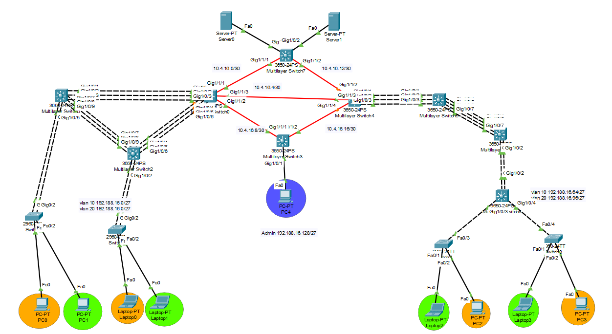
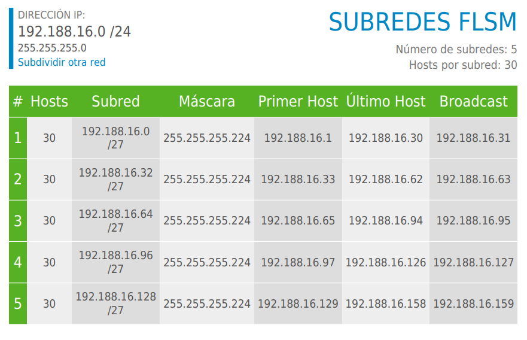

# Proyecto 1

## LAB REDES DE COMPUTADORAS 2

## G16

---

<p align="center">

| **CARNET**     |      **NOMBRE COMPLETO**       |
| -------------  | :----------------------------: |
| **201807499**  | JOHNNY WHILLMAN ALDANA OSORIO  |
| **202000774**  | GERSON DAVID OTONIEL GONZÁLEZ MORALES |
| **202001950**  | FERNANDO MISAEL MORALES ORTIZ  |

</p>

---


# Manual Tecnico
## Descripción del Proyecto
Manos Solidarias es una empresa comprometida con la responsabilidad social,
se dedica a apoyar a personas en situación de escasez de recursos y sin hogar. Su
enfoque se basa en brindar ayuda humanitaria y asistencia social a quienes más lo
necesitan, a través de diversos programas y proyectos que tienen como objetivo
mejorar las condiciones de vida de estas personas. Con un equipo altamente
capacitado y motivado, Manos Solidarias trabaja incansablemente para brindar apoyo a
la comunidad y crear un mundo más justo y equitativo para todos. Actualmente, deciden
emprender su nueva red y lo contratan a usted, experto en redes para que haga todo el
análisis correspondiente. Manos Solidarias cuenta con cuatro edificios en diferentes
zonas de la ciudad, cada edificio es una red LAN que al mismo tiempo desean que
estén conectados para tener comunicación.

## TOPOLOGIA

<p align="center">
    
</p>

## Subredes por FLSM
<p align="center">
    
</p>

## Subredes por VLSM


### Numero de Vlans

#### Lado Izquierdo

| VLAN    | NOMBRE VLAN  |
|---------|--------------|
| 10      | VLAN_Naranja_EdificioIZQ    |
| 20      | VLAN_Verde_EdificioIZQ     |


#### Lado Derecho

| VLAN    | NOMBRE VLAN  |
|---------|--------------|
| 10      | VLAN_Naranja_EdificioDER     |
| 20      | VLAN_Verde_EdificioDER      |

#### Lado Central

| VLAN    | NOMBRE VLAN  |
|---------|--------------|
|   30      | Administracion     |
---

### Comandos
---
###### Configuracion de vtp client y servidor

    Configuracion de vtp [client]
        - enable
        - configure terminal
        - vtp domain grupo16
        - vtp mode client
        - vtp password redes2
        - do wr
        - exit
        - show vtp status


    Configuracion de vtp [server]
            - enable
            - configure terminal
            - vtp domain grupo16
            - vtp mode server
            - vtp password redes2
            - do wr
            - exit
            - show vtp status


---

###### Creacion de VLAN

    - enable
    - configure terminal
    - vlan [numero de vlan]
    - name [nombre de la vlan]
    - exit
    - do wr
    - show vlan brief


    - Nota: Aplica para ambos lados la creacion de vlans.

---
###### Modo Truncal

    - enable
    - configure terminal
    - interface range fa0/[se define un rango] int fa0/[se define el rango]
    - switchport mode trunk
    - switchport trunk allowed vlan all
    - exit
    - do wr
    - exit
    - wr
    - show interfaces trunk

     

---

##### Modo Acceso 

    - enable
    - configure terminal
    - int fa0/[numero de interfaz]
    - switchport mode access
    - switchport access vlan [numero de vlan]
    - exit
    - do wr
    - exit
    - write memory


    

## Configuración de EIGRP

```bash
enable
configure terminal
router eigrp 100
 network 192.178.17.0 0.0.0.255
 network 192.178.27.0 0.0.0.255
 network 192.178.37.0 0.0.0.255
 network 10.8.10.0 0.0.0.255
 no auto-summary
exit
```

## Port-channel LACP

```bash
enable
conf t
interface range gi1/0/[rango de interfaces]
channel-protocol lacp
channel-group 1 mode active/dessactive 
no sh

exit
interface port-channel 1
switchport mode trunk
switchport trunk allowed vlan 10,20
do wr

```

## Port-channel PAGP

```bash
enable
conf t
interface range gi1/0/[rango de interfaces]
channel-protocol pagp
channel-group 1 mode auto/desirable 
no sh
do wr


```

## Direcciones IP en los swiches

```bash
enable
conf t
ip routing
interface vlan [numero de la vlan]
ip address 192.188.16.1 255.255.255.224

```

## Configuracion y redistribucion entre EIGRP y RIP (Router4 segun la topologia)

```
enable
conf t
int g0/0

```

## Configuracion y redistribucion entre RIP y OSPF (router2 segun la topologia)

```
enable
conf t
int g0/0
ip address 10.8.9.2 255.255.255.0
no shut

router rip
version 2

```

## Configuracion de OSPF y asignacion de interfaces virtuales
```
enable
conf t

router ospf 1
network 192.188.16.0 0.0.0.31 area 0
network 192.188.16.32 0.0.0.31 area 0

exit
```

## IP's asignadas entre Routers

Administrador | Interfaz | Direccion IP  | Red         |
--------------|----------|---------------|-------------|
Router 4      | Gi0/1    | 10.8.10.2     | 10.8.10.0 |
Router 4      | Gi0/0    | 10.8.9.1      | 10.8.9.0 |
Router 2      | Gi0/0    | 10.8.9.2      | 10.8.9.0 |
Router 2      | Gi0/1    | 10.8.8.1      | 10.8.8.0 |
Router 3      | Gi0/1    | 10.8.8.2      | 10.8.8.0 |
Router 3      | Gi0/0.67 | 192.178.67.1  | 192.178.67.0 |
Router 3      | Gi0/0.77 | 192.178.77.1  | 192.178.77.0 |
Router 3      | Gi0/0.87 | 192.178.87.1  | 192.178.87.0 |
