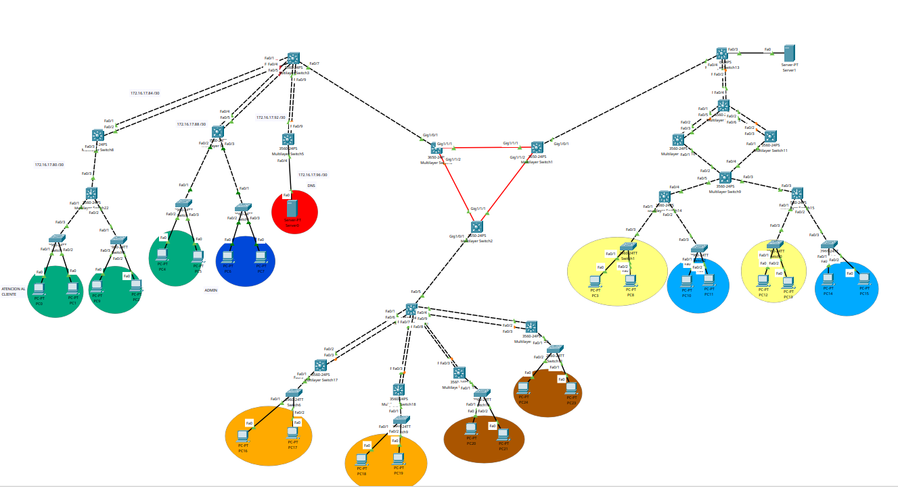
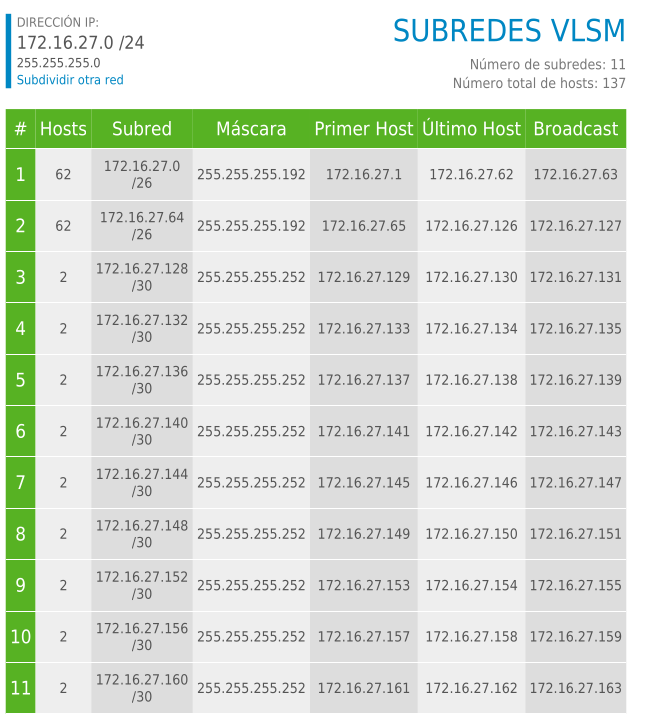
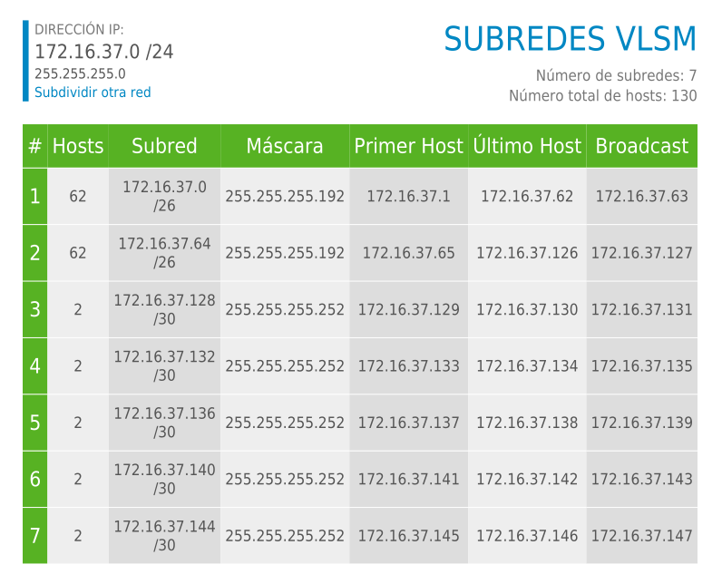
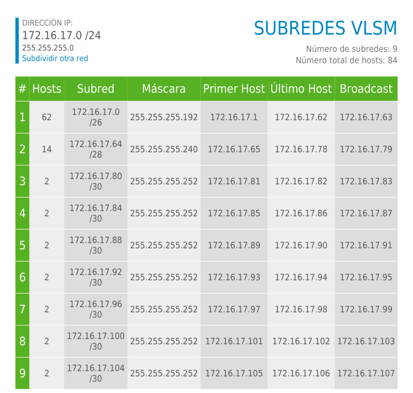

# Proyecto 2

## LAB REDES DE COMPUTADORAS 2

## G16


| **CARNET**     |      **NOMBRE COMPLETO**       |
| -------------  | :----------------------------: |
| **201807499**  | JOHNNY WHILLMAN ALDANA OSORIO  |
| **202000774**  | GERSON DAVID OTONIEL GONZÁLEZ MORALES |
| **202001950**  | FERNANDO MISAEL MORALES ORTIZ  |


---


# Manual Tecnico
## Descripción del Proyecto
El proyecto Telecom Uno, Redes Nacionales y Conexiones Futuras: Conectando al País busca simular la infraestructura de tres grandes proveedores de servicios de Internet (ISP) interconectados a nivel nacional.
Cada ISP fue diseñado con una topología específica y protocolos de enrutamiento dinámico que garantizan escalabilidad, redundancia y conectividad entre redes independientes.

La interconexión general se realiza mediante un backbone BGP, utilizando la red 192.168.16.0/16 como troncal nacional.
Cada ISP gestiona servicios de red esenciales:

- Telecom Uno (ISP 1): DNS y HTTP

- Redes Nacionales (ISP 2): DHCP y HSRP

- Conexiones Futuras (ISP 3): EIGRP y red inalámbrica

## TOPOLOGIA

<p align="center">
    
</p>


 


## Subredes por VLSM

### Redes nacionales

<p align="center">
    
</p>


### Redes futuras

<p align="center">
    
</p>


### Redes telecom

<p align="center">
    
</p>


###  Vlans


| VLAN    | NOMBRE VLAN  |
|---------|--------------|
| 10      |  Atención al Cliente  |
| 20      | Administración  |
| 20      | Ventas  |
| 20      | Facturación  |


### Comandos
---
###### Configuracion de vtp client y servidor

    Configuracion de vtp [client]
        - enable
        - configure terminal
        - vtp domain grupo16
        - vtp mode client
        - vtp password redes2
        - do wr
        - exit
        - show vtp status


    Configuracion de vtp [server]
            - enable
            - configure terminal
            - vtp domain grupo16
            - vtp mode server
            - vtp password redes2
            - do wr
            - exit
            - show vtp status


---

###### Creacion de VLAN

    - enable
    - configure terminal
    - vlan [numero de vlan]
    - name [nombre de la vlan]
    - exit
    - do wr
    - show vlan brief


    - Nota: Aplica para ambos lados la creacion de vlans.

---
###### Modo Truncal

    - enable
    - configure terminal
    - interface range fa0/[se define un rango] int fa0/[se define el rango]
    - switchport mode trunk
    - switchport trunk allowed vlan all
    - exit
    - do wr
    - exit
    - wr
    - show interfaces trunk

     

---

##### Modo Acceso 

    - enable
    - configure terminal
    - int fa0/[numero de interfaz]
    - switchport mode access
    - switchport access vlan [numero de vlan]
    - exit
    - do wr
    - exit
    - write memory


    

## Enrutamiento Dinámico

### OSPF (ISP 1 y 2)

```bash
enable
configure terminal
router ospf 10
network 172.16.17.0 0.0.0.255 area 0
network 172.16.27.0 0.0.0.255 area 0
exit

```

### EIGRP (ISP 3)

```bash
enable
conf t
interface range gi1/0/[rango de interfaces]
channel-protocol lacp
channel-group 1 mode active/dessactive 
no sh

exit
interface port-channel 1
switchport mode trunk
switchport trunk allowed vlan 10,20
do wr

```

### BGP (Backbone Nacional)

```bash
enable
conf t
router bgp 16
neighbor 192.168.16.2 remote-as 16
neighbor 192.168.16.3 remote-as 16
network 192.168.16.0 mask 255.255.0.0
exit

```

## Redundancia y agregación

### HSRP – Alta Disponibilidad (ISP 2)

```bash
interface g0/1
standby 1 ip 172.16.27.1
standby 1 priority 110
standby 1 preempt
exit


```

### LACP – Enlaces Troncales (ISP 1 y 2)

```
interface range g0/1 - 2
channel-protocol lacp
channel-group 1 mode active
no shutdown
exit
interface port-channel 1
switchport mode trunk
switchport trunk allowed vlan all
do wr

```

## Servicios

### Servidor DHCP (ISP 2)

```
ip dhcp pool REDES
network 172.16.27.0 255.255.255.0
default-router 172.16.27.1
dns-server 172.16.17.10
exit


```

