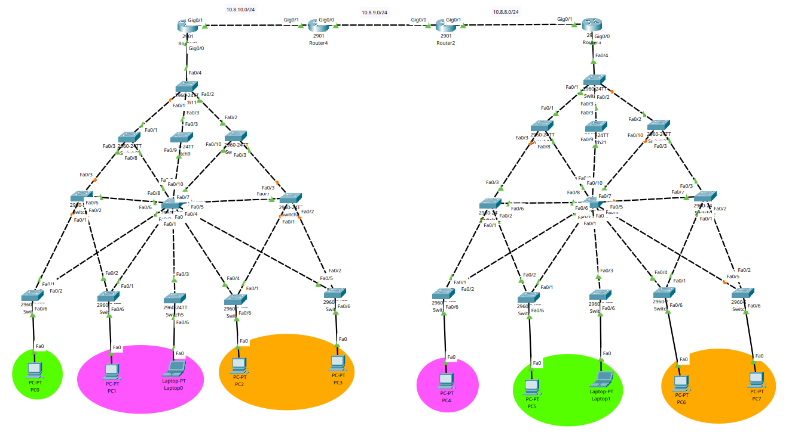

# Practica 1

## LAB REDES DE COMPUTADORAS 2

## G16

---

<p align="center">

| **CARNET**     |      **NOMBRE COMPLETO**       |
| -------------  | :----------------------------: |
| **201807499**  | JOHNNY WHILLMAN ALDANA OSORIO  |
| **202000774**  | GERSON DAVID OTONIEL GONZÁLEZ MORALES |
| **202001950**  | FERNANDO MISAEL MORALES ORTIZ  |

</p>

---


# Manual Tecnico
## Descripción del Proyecto
Alma Mater, es un colegio que se dedica a la enseñanza de niños desde la primaria hasta
diversificado. Con el inicio de la pandemia muchos empleados decidieron renunciar y,
entre ellos, iba el equipo completo del área de informática.

Inicialmente se llevaba un registro de direcciones IP utilizadas y un diagrama de los
puertos, switches y routers conectados, pero mientras el colegio creció, aumentaron sus
switches y sus conexiones para todas las áreas y se perdió el orden. El nuevo personal
de informática notó que habitualmente hay pérdidas de paquetes en las conexiones
entre los departamentos y no saben por qué. Se realizaron las mejoras para que el sistema 
este funcionando correctamente.
## TOPOLOGIA

<p align="center">
    
</p>

### Numero de Vlans

#### Lado Izquierdo

| VLAN    | NOMBRE VLAN  |
|---------|--------------|
| 17      | Primaria     |
| 27      | Basicos      |
| 37      | Diversificado |

#### Lado Derecho

| VLAN    | NOMBRE VLAN  |
|---------|--------------|
| 67      | Primaria     |
| 77      | Basicos      |
| 87      | Diversificado |

---

### Comandos
---
###### Configuracion de vtp client y servidor

    Configuracion de vtp [client]
        - enable
        - configure terminal
        - vtp mode client
        - do wr
        - exit
        - show vtp status


    Configuracion de vtp [server]
            - enable
            - configure terminal
            - vtp mode server
            - do wr
            - exit
            - show vtp status


---

###### Creacion de VLAN

    - enable
    - configure terminal
    - vlan [numero de vlan]
    - name [nombre de la vlan]
    - exit
    - do wr
    - show vlan brief


    - Nota: Aplica para ambos lados la creacion de vlans.

---
###### Modo Truncal

    - enable
    - configure terminal
    - interface range fa0/[se define un rango] int fa0/[se define el rango]
    - switchport mode trunk
    - switchport trunk allowed vlan all
    - exit
    - do wr
    - exit
    - wr
    - show interfaces trunk

     

---

##### Modo Acceso 

    - enable
    - configure terminal
    - int fa0/[numero de interfaz]
    - switchport mode access
    - switchport access vlan [numero de vlan]
    - exit
    - do wr
    - exit
    - write memory


    

---

###### Configuracion de Nombres y Passwords

    Swicht hostname
        - enable
        - configure terminal
        - hostname [nombre]
        - exit
        - wr


    Switch Password
        - enable
        - configure terminal
        - enable secret redes2grupo13
        - exit
        - wr

    - Establece una contraseña cifrada para el acceso al 
      modo privilegiado en el switch.


---

#### Configuracion PVST

##### Visaualizar la onfiguracion
    - show spanning-tree summary
##### Ver Configuracion
    - show spanning-tree
##### Configuracion de prioridad VLAN
    - enable
    - configure terminal
    - spannig-tree vlan [numero de vlan] root primary
    - exit
    - do wr
##### Visualizar los costos de los puertos VLAN
    - show spanning-tree vlan [numero de vlan]
##### Reducir costos de un puerto especifico
    - enable
    - configure terminal
    - int Fa0/[numero de interfaz a configurar]
    - spanning-tree cost 10
    - exit
    - do wr
##### Hablitar el PortFast en un puerto
    - enable
    - configure terminal
    - int Fa0/[numero de interfaz a configurar]
    - spannig-tree portfast
    - exit
    - do wr


#### Configuracion Rapid PVST

    - enable
    - configure terminal
    - spanning-tree mode rapid-pvst
    - do wr
    - exit
    - wr

 

----


## Configuracion de las IP
| Equipo                  | Dispositivo           | Dirección IP       |
|-----------------------|-----------------------|---------------------|
| PC1                   | PRIMARIA              | 192.178.17.2        |
| PC2                   | DIVERSIFICADO         | 192.178.37.2        |
| LAPTOP1               | DIVERSIFICADO         | 192.178.37.3        |
| PC3                   | BASICOS               | 192.178.27.2        |
| PC4                   | BASICOS               | 192.178.27.3        |
| PC5                   | DIVERSIFICADO         | 192.178.87.2        |
| LAPTOP2               | PRIMARIA              | 192.178.67.2        |
| PC6                   | PRIMARIA              | 192.178.67.3        |
| PC7                   | BASICOS               | 192.178.77.2        |
| PC8                   | BASICOS               | 192.178.77.3        |

## Elección de escenario con mejor resultado de convergencia

| Protocolo             | Red primaria          | Red Básicos         |Red Básicos         |
|-----------------------|-----------------------|---------------------|--------------------|
| PVST                  | 67s                   | 72s                 | 69s                |
| Rapid PVST            | 15s                   | 3s                  | 10s                |

Como se pudo comprobar en la recuperacion de paquetes se comprobo que los tiempos para el Rapid PVST 
es mas eficiente y la mejor opcion en la configuracion de redes, esto minimiza la pérdida de conectividad cuando falla un enlace principal

## Configuración de EIGRP

```bash
enable
configure terminal
router eigrp 100
 network 192.178.17.0 0.0.0.255
 network 192.178.27.0 0.0.0.255
 network 192.178.37.0 0.0.0.255
 network 10.8.10.0 0.0.0.255
 no auto-summary
exit
```

## Puertas de enlace determinada

```bash
enable
conf t
interface gi0/0.17
encapsulation dot1q 17
ip address 192.178.17.1 255.255.255.0
exit
interface gi0/0.27
encapsulation dot1q 27
ip address 192.178.27.1 255.255.255.0
exit
interface gi0/0.37
encapsulation dot1q 37
ip address 192.178.37.1 255.255.255.0
exit
interface gi0/0
no shutdown
exit
```

## Configuracion y redistribucion entre EIGRP y RIP (Router4 segun la topologia)

```
enable
conf t
int g0/0
ip address 10.8.9.1 255.255.255.0
no shut

router rip
version 2
network 10.8.9.0

router rip
redistribute eigrp 100 metric 1

router eigrp
redistribute rip metric 10000 100 255 1 1500
```

## Configuracion y redistribucion entre RIP y OSPF (router2 segun la topologia)

```
enable
conf t
int g0/0
ip address 10.8.9.2 255.255.255.0
no shut

router rip
version 2
network 10.8.9.0

int g0/1
ip address 10.8.8.1 255.255.255.0
no shut

router osfp 1
network 10.8.8.0 0.0.0.255 area 0

router rip
redistribute ospf 1 metric 1

router ospf 1
redistribute rip subnets

exit
```

## Configuracion de OSPF y asignacion de interfaces virtuales
```
enable
conf t
int gi0/1
ip address 10.8.8.2 255.255.255.0

int gi0/0.67
encapsulation dot1q 67
ip address 192.178.67.1 255.255.255.0

int gi0/0.77
encapsulation dot1q 77
ip address 192.178.77.1 255.255.255.0

int gi0/0.87
encapsulation dot1q 87
ip address 192.178.87.1 255.255.255.0

router ospf 1
network 10.8.8.0 0.0.0.255 area 0
network 192.178.67.0 0.0.0.255 area 0
network 192.178.77.0 0.0.0.255 area 0
network 192.178.87.0 0.0.0.255 area 0

exit
```

## IP's asignadas entre Routers

Administrador | Interfaz | Direccion IP  | Red         |
--------------|----------|---------------|-------------|
Router 4      | Gi0/1    | 10.8.10.2     | 10.8.10.0 |
Router 4      | Gi0/0    | 10.8.9.1      | 10.8.9.0 |
Router 2      | Gi0/0    | 10.8.9.2      | 10.8.9.0 |
Router 2      | Gi0/1    | 10.8.8.1      | 10.8.8.0 |
Router 3      | Gi0/1    | 10.8.8.2      | 10.8.8.0 |
Router 3      | Gi0/0.67 | 192.178.67.1  | 192.178.67.0 |
Router 3      | Gi0/0.77 | 192.178.77.1  | 192.178.77.0 |
Router 3      | Gi0/0.87 | 192.178.87.1  | 192.178.87.0 |
