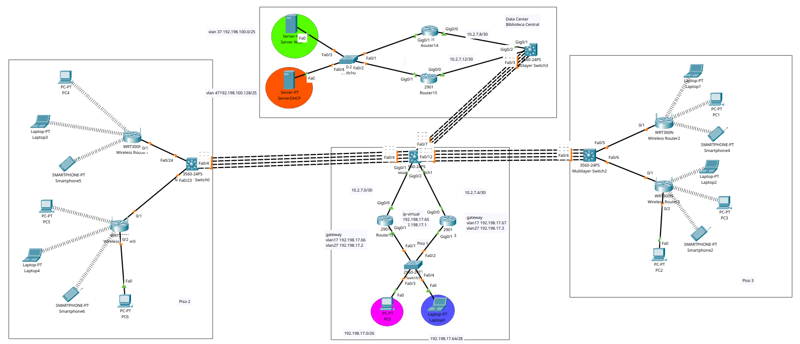

# PRACTICA 2

## Integrantes

| Nombre                                | Carnet    |
| ------------------------------------- | --------- |
| Fernando Misael Morales Ortíz         | 202001950 |
| Gerson David Otoniel González Morales | 202000774 |
| Johnny Whillman Aldana Osorio         | 201807499 |

## Topología




## VLANS

| VLAN          | ID  |
|---------------|-----|
| ADMIN         | 17  |
| ESTUDIANTES   | 27  |
| WEB_SERVERS   | 37  |
| DHCP_SERVERS  | 47  |


## VLSM

| #  | Anfitriones | Subred        | Máscara         | Anfitrión de introducción | Anfitrión de Último | Transmisión |
| -- | ----------- | ------------- | --------------- | ------------------------- | ------------------- | ----------- |
| 1  | 2           | 10.2.7.0 /30  | 255.255.255.252 | 10.2.7.1                  | 10.2.7.2            | 10.2.7.3    |
| 2  | 2           | 10.2.7.4 /30  | 255.255.255.252 | 10.2.7.5                  | 10.2.7.6            | 10.2.7.7    |
| 3  | 2           | 10.2.7.8 /30  | 255.255.255.252 | 10.2.7.9                  | 10.2.7.10           | 10.2.7.11   |
| 4  | 2           | 10.2.7.12 /30 | 255.255.255.252 | 10.2.7.13                 | 10.2.7.14           | 10.2.7.15   |
| 5  | 2           | 10.2.7.16 /30 | 255.255.255.252 | 10.2.7.17                 | 10.2.7.18           | 10.2.7.19   |
| 6  | 2           | 10.2.7.20 /30 | 255.255.255.252 | 10.2.7.21                 | 10.2.7.22           | 10.2.7.23   |
| 7  | 2           | 10.2.7.24 /30 | 255.255.255.252 | 10.2.7.25                 | 10.2.7.26           | 10.2.7.27   |
| 8  | 2           | 10.2.7.28 /30 | 255.255.255.252 | 10.2.7.29                 | 10.2.7.30           | 10.2.7.31   |
| 9  | 2           | 10.2.7.32 /30 | 255.255.255.252 | 10.2.7.33                 | 10.2.7.34           | 10.2.7.35   |
| 10 | 2           | 10.2.7.36 /30 | 255.255.255.252 | 10.2.7.37                 | 10.2.7.38           | 10.2.7.39   |
| 11 | 2           | 10.2.7.40 /30 | 255.255.255.252 | 10.2.7.41                 | 10.2.7.42           | 10.2.7.43   |

## Piso 1

| Dirección IP | Dirección de red | Máscara de red | Dirección de Broadcast |
| ------------ | ---------------- | -------------- | ---------------------- |
| 192.198.17.0 | 192.198.17.0 /24 | 255.255.255.0  | 192.198.17.255         |

| Subred   | N° de Hosts | IP de red         | Máscara         | Primer Host   | Último Host   | Broadcast     |
| -------- | ----------- | ----------------- | --------------- | ------------- | ------------- | ------------- |
| Subred 1 | 62          | 192.198.17.0 /26  | 255.255.255.192 | 192.198.17.1  | 192.198.17.62 | 192.198.17.63 |
| Subred 2 | 14          | 192.198.17.64 /28 | 255.255.255.240 | 192.198.17.65 | 192.198.17.78 | 192.198.17.79 |

## Piso 2

| Dirección IP | Dirección de red | Máscara de red | Dirección de Broadcast |
| ------------ | ---------------- | -------------- | ---------------------- |
| 192.198.27.0 | 192.198.27.0 /24 | 255.255.255.0  | 192.198.27.255         |

| Subred   | N° de Hosts | IP de red          | Máscara         | Primer Host    | Último Host    | Broadcast      |
| -------- | ----------- | ------------------ | --------------- | -------------- | -------------- | -------------- |
| Subred 1 | 126         | 192.198.27.0 /25   | 255.255.255.128 | 192.198.27.1   | 192.198.27.126 | 192.198.27.127 |
| Subred 2 | 126         | 192.198.27.128 /25 | 255.255.255.128 | 192.198.27.129 | 192.198.27.254 | 192.198.27.255 |

## Piso 3

| Dirección IP | Dirección de red | Máscara de red | Dirección de Broadcast |
| ------------ | ---------------- | -------------- | ---------------------- |
| 192.198.37.0 | 192.198.37.0 /24 | 255.255.255.0  | 192.198.37.255         |


| Subred   | N° de Hosts | IP de red          | Máscara         | Primer Host    | Último Host    | Broadcast      |
| -------- | ----------- | ------------------ | --------------- | -------------- | -------------- | -------------- |
| Subred 1 | 126         | 192.198.37.0 /25   | 255.255.255.128 | 192.198.37.1   | 192.198.37.126 | 192.198.37.127 |
| Subred 2 | 126         | 192.198.37.128 /25 | 255.255.255.128 | 192.198.37.129 | 192.198.37.254 | 192.198.37.255 |

## Biblioteca

| Dirección IP  | Dirección de red  | Máscara de red | Dirección de Broadcast |
| ------------- | ----------------- | -------------- | ---------------------- |
| 192.198.100.0 | 192.198.100.0 /24 | 255.255.255.0  | 192.198.100.255        |

| Subred   | N° de Hosts | IP de red           | Máscara         | Primer Host     | Último Host     | Broadcast       |
| -------- | ----------- | ------------------- | --------------- | --------------- | --------------- | --------------- |
| Subred 1 | 126         | 192.198.100.0 /25   | 255.255.255.128 | 192.198.100.1   | 192.198.100.126 | 192.198.100.127 |
| Subred 2 | 126         | 192.198.100.128 /25 | 255.255.255.128 | 192.198.100.129 | 192.198.100.254 | 192.198.100.255 |

## Comandos 

### Creación de vlans

```cisco
vlan 17
name ADMIN
vlan 27
name ESTUDIANTES
```
### Modo acceso

```cisco
interface gi0/3
swithport mode access
switchport access vlan 27
interface gi0/4
swithport mode access
switchport access vlan 17
```

### Modo trunk

```cisco
interface range gi0/1-2
switchport mode trunk
switchport trunk allowed vlan 17,27
```


### Vlan en los routers

```cisco
interface gi0/1.17
encapsulation dot1q 17
ip address 192.198.17.66 255.255.255.240

interface gi0/1.27
encapsulation dot1q 27
ip address 192.198.17.2 255.255.255.192

```

### HSRP

R1

```cisco
interface gi0/1.27
standby 1 ip 192.198.17.65
standby 1 priority 150
standby 1 preempt

interface gi0/1.17
standby 2 ip 192.198.17.1 
standby 2 priority 150
standby 2 preempt
```

### OPSF

```cisco
outer ospf 1
network 192.198.17.0 0.0.0.63 area 0
network 192.198.17.64 0.0.0.15 area 0
network 10.2.7.0 0.0.0.3 area 0
```

### LACP

R1

```cisco
interface range fa0/1-4
channel-protocol lacp
channel-group 1 mode active
exit

interface port-channel 1
no switchport
ip address 10.2.7.21 255.255.255.252
```


R2

```cisco
interface range fa0/1-4
channel-protocol lacp
channel-group 1 mode passive
exit

interface port-channel 1
no switchport
ip address 10.2.7.22 255.255.255.252

```


ip helper para DHCP

```cisco
interface gi0/1.17
encapsulation dot1q 17
ip helper-address 192.198.100.133

interface gi0/1.27
encapsulation dot1q 27
ip helper-address 192.198.100.133
```